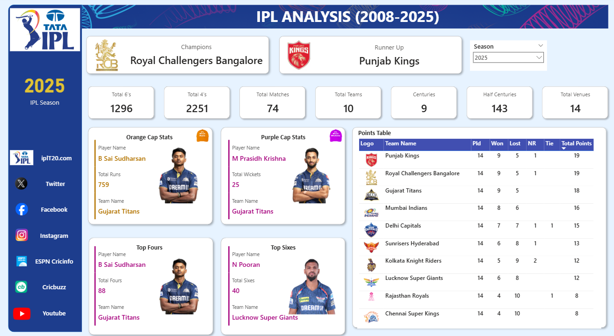

# 🏏 IPL T20 Analysis Dashboard (2008–2025)

This Power BI dashboard provides a comprehensive statistical analysis of the Indian Premier League (IPL) from its inaugural season in 2008 up to 2025. It focuses on season-wise team performance, player achievements, match metrics, and batting highlights in an interactive and visual-first format.
## 📚 Table of Contents
- [Project Objectives](#-project-objectives)
- [Dashboard Features](#-dashboard-features)
- [IPL 2025 Season Highlights](#-ipl-2025-season-highlights)
- [Dashboard Preview](#./ipl-dashboard-screenshot.png)
- [Files Included](#-files-included)
- [How to Use](#-how-to-use)
- [Tools & Technologies](#-tools--technologies)
- [Author](#-author)
- [License](#-license)
- [Quote](#-quote)

## 📌 Project Objectives

• Analyze IPL statistics across all seasons from 2008 to 2025  
• Visualize top performers: Orange Cap, Purple Cap, 4s, and 6s  
• Track seasonal totals: matches, venues, centuries, boundaries  
• Explore team-wise standings with win/loss records  
• Deliver an intuitive and interactive user experience  

## ✨ Dashboard Features

• Season-wise filters (2008–2025)  
• Team standings: matches, wins, losses, ties, NR, points  
• Leaderboards: most runs, wickets, sixes, and fours  
• KPI tiles: total 6s, 4s, centuries, half-centuries, venues  
• Orange Cap & Purple Cap cards  
• Clean IPL-themed design with branding and logos  

## 🚀 IPL 2025 Season Highlights

• Champions: Royal Challengers Bangalore  
• Runner-Up: Punjab Kings  
• Orange Cap: B Sai Sudharsan – 759 runs (Gujarat Titans)  
• Purple Cap: M Prasidh Krishna – 25 wickets (Gujarat Titans)  
• Most Sixes: N Pooran – 40  
• Most Fours: B Sai Sudharsan – 88  
• Matches: 74 | Teams: 10 | Venues: 14  
• 6s: 1296 | 4s: 2251 | Centuries: 9 | Half-Centuries: 143  

## 🖼️ Dashboard Preview

📸 Screenshot  

🎥 Walkthrough Video  
[▶️ Click to Watch](./ipl-dashboard-demo.mp4)

## 📂 Files Included

• `IPL_Analysis_2008_2025.pbit` – Power BI dashboard template  
• `ipl-dashboard-screenshot.png` – Dashboard image preview  
• `ipl-dashboard-demo.mp4` – Interactive screen recording  
• `IPL_Analysis_2008_2025.pdf` – Static PDF of the dashboard  
• `IPL_Data.zip ` – Dataset used in the dashboard  

## 🛠️ How to Use

1. Clone or download the repository  
2. Open `IPL_Analysis_2008_2025.pbit` in Power BI Desktop  
3. Load the dataset when prompted or connect your own  
4. Use slicers and visuals to explore IPL stats from 2008–2025  

## 🧰 Tools & Technologies

• Power BI Desktop – visualization  
• Excel / CSV – data preparation  
• Power Query – data transformation (ETL)  

## 👨‍💻 Author

👤 Ankit Chaudhary                                                                                                                                                                                                   
📧 ankitchaudhary14022003@gmail.com                                                                                                                                                                                  
🎓 Computer Engineering Graduate | Data & Business Analytics Enthusiast

## 📄 License

This project is licensed under the MIT License.  
Feel free to use, modify, and share with proper credit.

## 💬 Quote

"IPL isn’t just a tournament — it’s 17 years of unforgettable data.  
This dashboard brings every stat and story to life."
